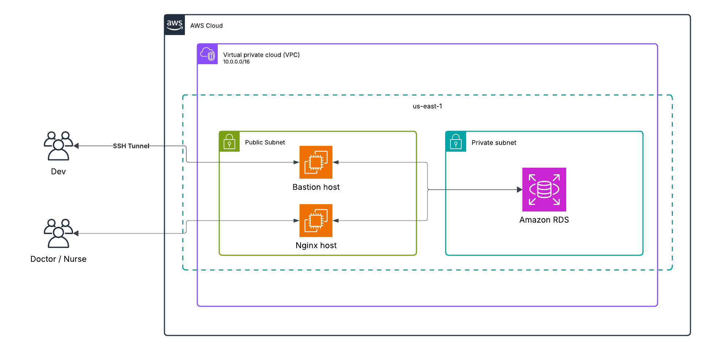

# Medipanel with AWS Integration

> A modern web application built with **Next.js** that integrates with AWS services.  
> Includes typed API responses and dynamic actions based on result types.

---

## 📜 Project Overview

This project uses **Next.js (App Router)** with TypeScript for strongly typed API responses and structured error handling.  
It also integrates with AWS services 



---

## 📂 Project Structure

````

.
├── app/                  # Next.js App Router pages
├── components/           # Reusable UI components
├── lib/                  # Utility functions
├── types/                # TypeScript type definitions
├── public/               # Static assets
└── README.md             # Project documentation

````

---

## 🛠 Tech Stack

- **Frontend**: Next.js 14 (App Router)
- **Language**: TypeScript
- **Styling**: Tailwind CSS
- **AWS**: (e.g., Amplify, RDS, Lambda — fill in specifics)
- **Version Control**: Git + GitHub

---

## 🧩 Type Definitions

We define two main result types for API responses:

```ts
export type MyError = {
    success: boolean;
    message: string;
};

export type MyConfirmation = {
    confirmationRequired: boolean;
    message: string;
};
````

---

## 🔄 Example Usage

```ts
import { MyError, MyConfirmation } from "@/types";

type APIResult = MyError | MyConfirmation;

function handleResult(result: APIResult) {
    if ("success" in result) {
        console.error("Error:", result.message);
    } else if ("confirmationRequired" in result) {
        console.log("Confirmation needed:", result.message);
    }
}
```

---

## 🚀 Getting Started

### 1️⃣ Clone the repository

```bash
git clone https://github.com/your-username/your-repo.git
cd your-repo
```

### 2️⃣ Install dependencies

```bash
npm install
```

### 3️⃣ Run locally

```bash
npm run dev
```

### 4️⃣ Build for production

```bash
npm run build
npm run start
```

---

## 📌 Notes

* Replace the AWS architecture placeholder with your actual diagram.
* Add your `.env.local` file with AWS credentials and project secrets.

---